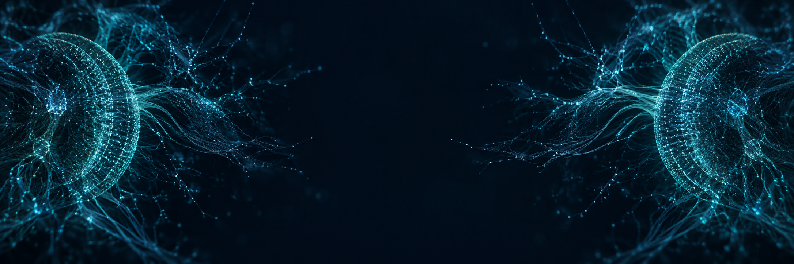

# nfly

**A standardised fly-brain neural network built from the Janelia MaleCNS v1.0 connectome, with
standardised reinforcement-learning infrastructure and a live viewer.**
<strong><ins>It speaks the OpenAI Gym / Gymnasium protocol, so it can be pointed at any task and trained in minutes.</ins></strong>

nfly turns the male *Drosophila* central nervous system (166,700 annotated neurons, 10.5M
synaptic connections) into a sparse, sign-constrained recurrent network you can drop into any
Gymnasium environment. Observations land on the fly's compound eye, activity flows through the
real wiring, and descending / motor neurons are read out as actions.

<p align="center">
  <a href="docs/assets/fly-anatomy.gif?raw=true"></a>
  <br />
  <em>Eyes: visual input. Body: connectome-constrained recurrent network. Feet: Gym action output.</em>
</p>

[Open the GIF](docs/assets/fly-anatomy.gif?raw=true) | [Full-size diagram](docs/assets/fly-anatomy.png) | [Editable Blender scene](docs/assets/mechanical-fly-annotated.blend)

```text
observation        (gym observation_space: frames, vectors, ...)
     |
     |  ObservationEncoder      retina sampling on the compound eye, or a linear projection
     v
input neurons      photoreceptors / sensory neurons of the connectome
     |
     |  ConnectomeRNN           whole-CNS sparse dynamics on the real wiring
     v
readout neurons    descending + motor neurons
     |
     |  ActionDecoder           Categorical (Discrete) or Gaussian (Box) head
     v
action             (gym action_space)
```

## About the data: Janelia MaleCNS v1.0



[MaleCNS](https://male-cns.janelia.org/) is the first complete connectome of an adult male
*Drosophila melanogaster* central nervous system: brain and ventral nerve cord imaged with
electron microscopy, every neuron reconstructed and proofread, every synapse detected, and
166,691 neurons annotated into 11,691 cell types with predicted neurotransmitters. It was
produced by FlyEM (HHMI Janelia Research Campus) with the University of Cambridge, the MRC
Laboratory of Molecular Biology and Google Research; version 1.0 was released on 8 June 2026
under CC-BY 4.0. nfly uses three of its flat-connectome exports (body annotations, body
neurotransmitters, connectome weights) from the
[download page](https://male-cns.janelia.org/download/).

Citation:

> Berg, S., Beckett, I. R., Costa, M., Schlegel, P., Januszewski, M., Marin, E. C., Nern, A.,
> et al. *Sexual dimorphism in the complete connectome of the Drosophila male central nervous
> system.* Cell (2026); preprint bioRxiv 2025.10.09.680999,
> <https://doi.org/10.1101/2025.10.09.680999>. Data: <https://male-cns.janelia.org/>

## What is in the box

| Component | Package | What it gives you |
| --- | --- | --- |
| **Fly network** | `nfly.connectome`, `nfly.brain` | MaleCNS v1.0 loader, named sub-networks, `ConnectomeRNN` (fixed wiring and signs, learnable per-edge gain, per-neuron leak and bias), stimulation experiments |
| **Gym interface** | `nfly.interface`, `nfly.agent`, `nfly.suite` | Encoders / decoders chosen automatically from `observation_space` / `action_space`; `FlyAgent` recurrent policy; `GameSuite` base class with Atari, classic-control and generic-Gymnasium suites |
| **RL infrastructure** | `nfly.rl.simple`, `nfly.rl.rllib` | Readable pure-PyTorch A2C / PPO for learning and quick experiments; Ray RLlib `FlyRLModule` + config builders (PPO / APPO / IMPALA) for producing models at scale |
| **Viewer** | `nfly.viz` | Browser page streaming the rendered frame, action probabilities, action timeline and step log for any (policy, env) session, with pause / step / reset |

Everything is layered one way (`connectome -> brain -> interface -> agent -> suite -> rl / viz`):
the brain never sees a game, the suite never sees the brain, and a new task, sense, or algorithm
is a new subclass in its own layer.

## Installation

### Environment

The project is managed with [uv](https://docs.astral.sh/uv/): one `pyproject.toml`, one
`uv.lock`, one `.venv` per checkout.

```bash
git clone https://github.com/zhengxuyu/nfly.git && cd nfly
curl -LsSf https://astral.sh/uv/install.sh | sh        # uv, once per machine
uv sync --extra dev                                     # .venv with torch, gymnasium, ale-py, ray, pytest
uv run pytest -q                                        # 25 tests on a synthetic connectome, no download needed
```

`uv sync` alone installs only the core (torch, pandas, pyarrow); add `--extra games` for the
suites and the viewer, `--extra rllib` for Ray. On a CUDA machine `uv sync` resolves the matching
torch build automatically. Prefix commands with `uv run` or activate `.venv`.

### Data

Three public files from the MaleCNS v1.0 release (CC-BY 4.0, no login, 1.2 GB), into `data/`:

```bash
B=https://storage.googleapis.com/flyem-male-cns/v1.0/connectome-data/flat-connectome
curl -o data/body-annotations.feather        $B/body-annotations-male-cns-v1.0-minconf-0.5.feather   # 14 MB
curl -o data/body-neurotransmitters.feather  $B/body-neurotransmitters-male-cns-v1.0.feather         # 43 MB
curl -o data/connectome-weights.feather      $B/connectome-weights-male-cns-v1.0-minconf-0.5.feather # 1.1 GB
```

The first load filters the 152M-row weights table down to annotated neurons (about 25 s) and
caches the result under `data/cache/`. Check that everything is in place:

```bash
uv run scripts/demo_stimulate.py --class gustatory       # drive taste neurons, see which cell types light up
```

## Example: train the fly on Pong and watch it play

Works on a laptop (CPU) end to end; a GPU makes training about 7x faster.

### 1. Play untrained

```bash
uv run scripts/play.py --suite atari --game pong          # the whole CNS plays one Pong episode
```

### 2. Train

Simple PPO (single process, easiest to read and to modify):

```bash
uv run scripts/train_rl.py --algo ppo --suite atari --game pong --subset visual \
    --envs 8 --rollout 32 --updates 5000 --device cuda --out runs/ppo-atari-pong.pt
```

RLlib (multiple env runners, asynchronous APPO, checkpoints every 10 iterations):

```bash
uv run scripts/train_rllib.py --algo APPO --suite atari --game pong --subset visual \
    --env-runners 8 --envs-per-runner 2 --gpus 1 --rnn-steps 1 --train-batch 4096 \
    --entropy-coeff 0.01 --iters 2000 --out runs/rllib-pong
```

Both print one line per update / iteration (return, entropy, KL, timers) and save checkpoints
atomically, so you can copy or view them while training continues. On a shared or remote GPU
box, launch with `setsid nohup ... > runs/x.log 2>&1 < /dev/null &` and `tail -f` the log.

### 3. Watch it play

```bash
uv run scripts/serve.py --suite atari --game pong --subset visual --checkpoint runs/ppo-atari-pong.pt
# open http://127.0.0.1:8000
```

The page shows the frame, the six action probabilities, a colour-coded action timeline with
reward ticks and a step log; pause, single-step, reset and change the playback speed from the
page. Without a checkpoint you get the untrained brain; with `--policy random` you can check any
env renders before loading a brain.

### 4. Swap the task

```bash
uv run scripts/play.py --suite classic --game cartpole                      # vector observations, same brain
uv run scripts/train_rl.py --algo ppo --suite gym --game LunarLander-v3    # any registered Gymnasium id
```

No model code changes: encoders and decoders are picked from the env's spaces.

## Extending

### Your own game collection

```python
from nfly.suite import GameSuite, register

@register("mygames")
class MySuite(GameSuite):
    def games(self):
        return ["level1", "level2"]

    def make(self, game, seed=None, render_mode=None, **kw):
        return self.finish(MyEnv(game, render_mode=render_mode), seed)   # any gym.Env
```

`make_vector`, `spaces` and `finish` come from the base class; every script accepts
`--suite mygames --game level1`.

### Your own senses or muscles

Subclass `ObservationEncoder` (provide `idx`, the neurons you drive, and `encode`) or
`ActionDecoder` (provide `dist_inputs` and `distribution`) and pass them to
`FlyAgent.build(..., encoder=..., decoder=...)`.

### Your own algorithm

`nfly.rl.simple.common` has rollout collection, GAE and replay; a new trainer is a config
dataclass plus a loop (see `ppo.py`, about 80 lines). For RLlib, `FlyRLModule` already
implements the stateful `TorchRLModule` + `ValueFunctionAPI` contract, so any value-based RLlib
algorithm works through `build_config(algo, ...)`.

### Programmatic use

```python
from nfly import load_malecns, select_subset, FlyAgent
from nfly.suite import get_suite, play_episode
from nfly.viz import SessionConfig, serve

conn = select_subset(load_malecns("data"), "visual")            # all | brain | visual | visual_small
env = get_suite("atari").make("breakout", seed=0)
agent = FlyAgent.build(conn, env.observation_space, env.action_space)
print(play_episode(agent, env).ret)

server = serve(SessionConfig(suite="atari", game="breakout", checkpoint="runs/ppo.pt"), port=8000)
```

## Biology -> network

| Biology (MaleCNS field) | Network | Rule |
| --- | --- | --- |
| `bodyId` with a `superclass` | node i, scalar state h_i(t) | fragments and glia (no superclass) are excluded |
| weights table (body_pre, body_post, weight) | sparse entry W[post, pre] | pairs with >= 3 synapses by default (`min_syn`) |
| presynaptic `consensus_nt` | sign of that column, fixed (Dale's law) | ACh / DA / 5-HT / OA are +, GABA / Glu / His are -, unclear is + |
| `weight` (synapse count) | magnitude | weight / total input synapses of the postsynaptic neuron |
| `superclass` in `*_sensory`, `sensory_ascending`, `sensory_descending` | input layer, flow = afferent | external drive u(t) enters here |
| `superclass` in `*_motor`, `*_efferent`, `*_endocrine` | output layer, flow = efferent | |
| everything else (intrinsic, visual projection, descending, ascending, ...) | hidden layer, flow = intrinsic | |
| `assignedOlHex1/2` (hex coordinates of optic-lobe columnar cells) | retina coordinates | photoreceptors are placed at the synapse-weighted coordinate of their columnar targets; left eye sees the left half of the frame |
| `descending_neuron` + `*_motor` | action readout neurons | LayerNorm -> linear heads |
| membrane time constant, threshold | per-neuron alpha_i, b_i | learnable |

Dynamics:

```text
h[t+1] = (1 - alpha) * h[t] + alpha * min( ReLU( W h[t] + b + u[t] ), h_max )
W[post, pre] = sign(pre) * (syn / sum_in syn) * exp(g_edge)        g_edge learnable, initialised to 0
```

The resting bias b starts at 0.1: photoreceptors release only histamine (inhibitory), so with all
neurons at 0 no inhibitory input could ever be read by a ReLU unit. With a little tonic activity,
light shows up as a decrease downstream, matching real L1/L2 responses. At global gain 1.0 the
whole CNS keeps a stable baseline; gain 5 diverges.

The sparse product is a gather + `index_add` with a custom backward, processed in edge chunks, so
backprop through time stores only the (batch x N) state per step and never a (batch x edges)
tensor. Derived edge weights are computed once per unroll and cached during inference.

### Sub-networks

| Name | Content | Neurons | Edges (>= 3 syn) |
| --- | --- | --- | --- |
| all | whole central nervous system | 166,700 | 10.5M |
| brain | without the ventral nerve cord | ~146,000 | |
| visual | optic lobes + visual projection + central brain + descending neurons | 138,743 | 8.4M |
| visual_small | optic lobes + visual projection + descending neurons | 106,579 | 5.2M |

## What this is and is not

nfly reproduces the fly's **wiring**: which neurons exist, who connects to whom with how many
synapses, and the predicted sign of each connection. Everything else is a deliberate
simplification: one scalar rate per neuron, no spikes, ion channels, gap junctions, glia,
neuromodulation or plasticity rules; game pixels reach the photoreceptors through an assumed
hex-to-image mapping; the descending-neuron-to-action readout is learned; and training changes
edge gains, biases and time constants, so a trained model is connectome-*constrained*, not a
copy of the animal.

## Performance

| Scenario | CPU (M-series laptop) | RTX 5090 |
| --- | --- | --- |
| whole CNS playing Pong (inference) | 30 ms / step | 8 ms / step |
| `visual` subset, simple PPO, 8 envs | 41 steps / s | 220 steps / s |
| `visual` subset, 32-step unroll fwd+bwd, batch 8 | | 0.9 s (about 280 steps / s) |

Training throughput is bound by the sparse product over millions of edges, not by the RL
framework. `--rnn-steps 1`, the `visual_small` subset and asynchronous APPO are the three knobs
that buy the most speed. RLlib stores the recurrent state (one float per neuron) at every time
step of every episode, so keep `--max-seq-len` moderate.

## Benchmarks

Scores obtained so far, recorded as they are. All runs use the MaleCNS `visual` sub-network
(138,743 neurons, 8.4M edges) on one shared RTX 5090; "return" is the mean episode return of the
last 20 episodes at the end of the run. Pong reference points: random policy about -20.7,
human about 14.6 (Mnih et al. 2015).

| Game | Trainer | Config | Env steps | Return | Entropy at end | Notes |
| --- | --- | --- | --- | --- | --- | --- |
| Pong | simple A2C | rnn_steps 2, 8 envs, rollout 16, lr 3e-4, entropy 0.01 | 321k | -20.5 | 0.64 | policy collapsed to two actions within 100k steps, partial recovery |
| Pong | simple PPO | rnn_steps 2, 8 envs, rollout 32, 3 epochs, clip 0.2, entropy 0.01 | 289k | -19.8 | 0.55 | slower collapse than A2C, no score gain |
| Pong | RLlib PPO | rnn_steps 2, 8 runners x 2 envs, batch 4096, minibatch 256 | 41k | -20.6 | 1.66 | stopped by a checkpoint-path bug (fixed) |
| Pong | RLlib APPO | rnn_steps 1, 8 runners x 2 envs, batch 4096, minibatch 256, entropy 0.01 | 120k (running) | -20.5 | 1.68 | entropy stable so far; 160 env steps / s |

None of these runs has learned Pong yet: they are all inside the first few hundred thousand
steps, where a standard CNN policy also still scores about -21. The table is here to be
updated, including negative results. To add a row, run one of the training commands above,
read the last log line (simple trainers) or the last `{"iter": ...}` line (RLlib), and record
the config, env steps, return and entropy.

## Code principles

The project follows the code-smell catalogue at
<https://refactoring.guru/refactoring/smells>. The checklist applied to every change lives in
[CLAUDE.md](CLAUDE.md), together with the language rule (all committed text in English, ASCII
source), the one-directional layer rule and the uv-only environment rule.

## License and citation

Code: [MIT](LICENSE). Data: MaleCNS v1.0, CC-BY 4.0 (see [About the data](#about-the-data-janelia-malecns-v10)
for the citation). Please cite the MaleCNS paper when you publish results built on this model.

README artwork: the [hero](docs/assets/hero-mechanical.png) and [neural background](docs/assets/background.png)
are AI-generated illustrations, not MaleCNS visualisations. The [mechanical fly animation](docs/assets/fly-anatomy.gif)
is rendered frame by frame in Blender from a 3D model with titanium armor plates, hexagonal optical
lenses, machined fasteners, piston-driven legs and translucent photonic wings. It is conceptual artwork.
Its camera-facing labels map the eyes to `RetinaEncoder`, the body to the sparse rate-based
`ConnectomeRNN`, and the feet to `ActionDecoder`. The six feet illustrate output collectively;
they do not imply six fixed actions. The frame-to-hex diagram is illustrative, not a recorded rollout.
View the [full-resolution diagram](docs/assets/fly-anatomy.png), open the
[annotated Blender scene](docs/assets/mechanical-fly-annotated.blend), or regenerate with Blender and FFmpeg:

```bash
blender --background docs/assets/mechanical-fly.blend \
  --python docs/assets/annotate_mechanical_blender.py -- --frames 72
uv run python docs/assets/assemble_anatomy.py
```
