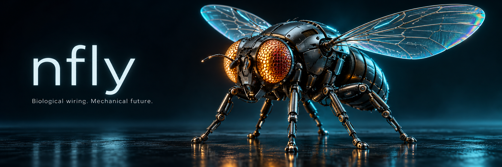
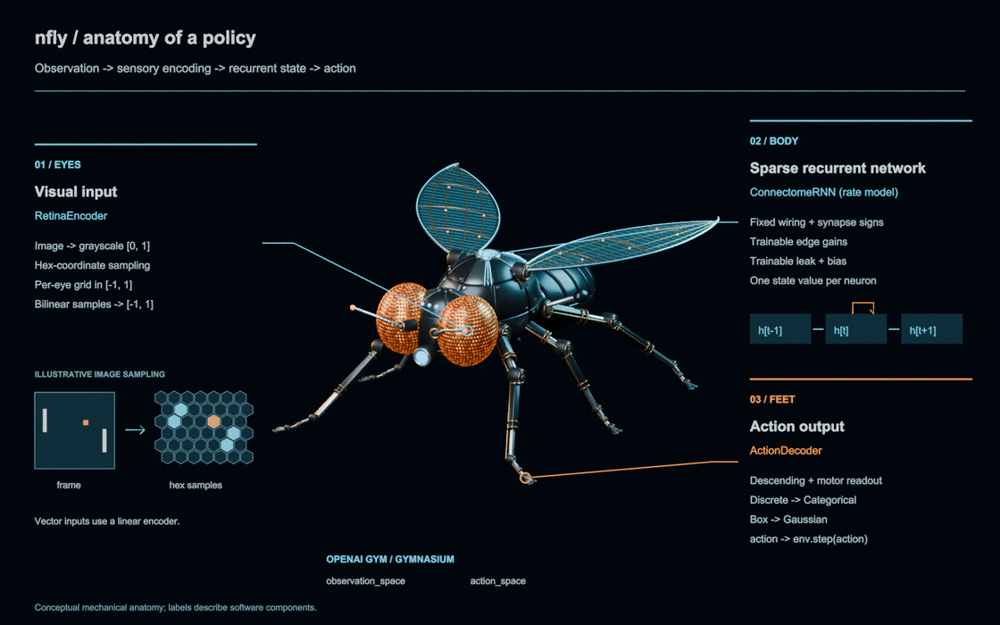

# nfly

**A standardised fly-brain neural network built from the Janelia MaleCNS v1.0 connectome, with
standardised reinforcement-learning infrastructure and a live viewer.**
<strong><ins>It speaks the OpenAI Gym / Gymnasium protocol, so it can be pointed at any task and trained in minutes.</ins></strong>

nfly turns the male *Drosophila* central nervous system (166,700 annotated neurons, 10.5M
synaptic connections) into a sparse, sign-constrained recurrent network you can drop into any
Gymnasium environment. Observations land on the fly's compound eye, activity flows through the
real wiring, and descending / motor neurons are read out as actions.

<p align="center">
  <a href="docs/assets/fly-anatomy.gif?raw=true"></a>
  <br />
  <em>Eyes: visual input. Body: connectome-constrained recurrent network. Feet: Gym action output. (<a href="docs/artwork.md">about the artwork</a>)</em>
</p>

```text
observation        (gym observation_space: frames, vectors, ...)
     |
     |  ObservationEncoder      retina sampling on the compound eye, or a linear projection
     v
input neurons      photoreceptors / sensory neurons of the connectome
     |
     |  ConnectomeRNN           whole-CNS sparse dynamics on the real wiring
     v
readout neurons    descending + motor neurons
     |
     |  ActionDecoder           Categorical (Discrete) or Gaussian (Box) head
     v
action             (gym action_space)
```

## About the data: Janelia MaleCNS v1.0

[MaleCNS](https://male-cns.janelia.org/) is the first complete connectome of an adult male
*Drosophila melanogaster* central nervous system: brain and ventral nerve cord imaged with
electron microscopy, every neuron reconstructed and proofread, every synapse detected, and
166,691 neurons annotated into 11,691 cell types with predicted neurotransmitters. It was
produced by FlyEM (HHMI Janelia Research Campus) with the University of Cambridge, the MRC
Laboratory of Molecular Biology and Google Research; version 1.0 was released on 8 June 2026
under CC-BY 4.0. nfly uses three of its flat-connectome exports from the
[download page](https://male-cns.janelia.org/download/).

> Berg, S., Beckett, I. R., Costa, M., Schlegel, P., Januszewski, M., Marin, E. C., Nern, A.,
> et al. *Sexual dimorphism in the complete connectome of the Drosophila male central nervous
> system.* Cell (2026); preprint bioRxiv 2025.10.09.680999,
> <https://doi.org/10.1101/2025.10.09.680999>. Data: <https://male-cns.janelia.org/>

## What is in the box

| Component | Package | What it gives you |
| --- | --- | --- |
| **Fly network** | `nfly.connectome`, `nfly.brain` | MaleCNS v1.0 loader, named sub-networks, `ConnectomeRNN` (fixed wiring and signs, learnable per-edge gain, per-neuron leak and bias), stimulation experiments |
| **Gym interface** | `nfly.interface`, `nfly.agent`, `nfly.suite` | Encoders / decoders chosen automatically from `observation_space` / `action_space`; `FlyAgent` recurrent policy; `GameSuite` base class with Atari, classic-control and generic-Gymnasium suites |
| **RL infrastructure** | `nfly.rl.simple`, `nfly.rl.rllib` | Readable pure-PyTorch A2C / PPO for learning and quick experiments; Ray RLlib `FlyRLModule` + config builders (PPO / APPO / IMPALA) for producing models at scale |
| **Viewer** | `nfly.viz` | Browser page streaming the rendered frame, the photoreceptor input on both compound eyes, the brain in 3-D (MaleCNS neuropil meshes, official neuron skeletons and somata coloured by live activity), signal propagation stage by stage within each frame, click-to-follow neurons with cell type and activity trace, the most responsive cell types per frame, a second checkpoint side by side, action probabilities, action timeline and step log, with pause / step / reset |

Everything is layered one way (`connectome -> brain -> interface -> agent -> suite -> rl / viz`);
a new task, sense, or algorithm is a new subclass in its own layer ([docs/extending.md](docs/extending.md)).

## Installation

```bash
git clone https://github.com/zhengxuyu/nfly.git && cd nfly
curl -LsSf https://astral.sh/uv/install.sh | sh        # uv, once per machine
uv sync --extra dev                                     # .venv with torch, gymnasium, ale-py, ray, pytest
uv run pytest -q                                        # tests on a synthetic connectome, no download needed
```

`uv sync` alone installs only the core; add `--extra games` for the suites and the viewer,
`--extra rllib` for Ray. Then fetch the three public MaleCNS v1.0 files (CC-BY 4.0, no login,
1.2 GB) into `data/`:

```bash
B=https://storage.googleapis.com/flyem-male-cns/v1.0/connectome-data/flat-connectome
curl -o data/body-annotations.feather        $B/body-annotations-male-cns-v1.0-minconf-0.5.feather   # 14 MB
curl -o data/body-neurotransmitters.feather  $B/body-neurotransmitters-male-cns-v1.0.feather         # 43 MB
curl -o data/connectome-weights.feather      $B/connectome-weights-male-cns-v1.0-minconf-0.5.feather # 1.1 GB
uv run scripts/demo_stimulate.py --class gustatory       # first load filters and caches (about 25 s); drives taste neurons
uv run scripts/fetch_anatomy.py                          # optional, for the viewer: official neuropil meshes and descending-neuron skeletons (about 60 MB)
```

## Example: train the fly on Pong and watch it play

Works on a laptop (CPU) end to end; a GPU makes training about 7x faster.

```bash
# 1. play untrained: the whole CNS plays one Pong episode
uv run scripts/play.py --suite atari --game pong

# 2. train with the simple PPO (single process, easiest to read and modify) ...
uv run scripts/train_rl.py --algo ppo --suite atari --game pong --subset visual \
    --envs 16 --updates 5000 --device cuda --out runs/ppo-atari-pong.pt
# ... or with RLlib (multiple env runners, asynchronous APPO)
uv run scripts/train_rllib.py --algo APPO --suite atari --game pong --subset visual \
    --env-runners 8 --envs-per-runner 2 --gpus 1 --train-batch 4096 --iters 2000 --out runs/rllib-pong

# 3. watch it play at http://127.0.0.1:8000 (frame, compound eyes, 3-D brain activity, action stream)
uv run scripts/serve.py --suite atari --game pong --subset visual --checkpoint runs/ppo-atari-pong.pt

# 4. swap the task: encoders and decoders are picked from the env's spaces, no model code changes
uv run scripts/play.py --suite classic --game cartpole
uv run scripts/train_rl.py --algo ppo --suite gym --game LunarLander-v3
```

Both trainers print one line per update (return, entropy, KL, timers) and save checkpoints
atomically, so the viewer can load them while training continues.

## Biology -> network

| Biology (MaleCNS field) | Network | Rule |
| --- | --- | --- |
| `bodyId` with a `superclass` | node i, scalar state h_i(t) | fragments and glia (no superclass) are excluded |
| weights table (body_pre, body_post, weight) | sparse entry W[post, pre] | pairs with >= 3 synapses by default (`min_syn`) |
| presynaptic `consensus_nt` | sign of that column, fixed (Dale's law) | ACh / DA / 5-HT / OA are +, GABA / Glu / His are -, unclear is + |
| `weight` (synapse count) | magnitude | weight / total input synapses of the postsynaptic neuron |
| `superclass` in `*_sensory`, `sensory_ascending`, `sensory_descending` | input layer, flow = afferent | external drive u(t) enters here |
| `superclass` in `*_motor`, `*_efferent`, `*_endocrine` | output layer, flow = efferent | |
| everything else (intrinsic, visual projection, descending, ascending, ...) | hidden layer, flow = intrinsic | |
| `assignedOlHex1/2` (hex coordinates of optic-lobe columnar cells) | retina coordinates | photoreceptors are placed at the synapse-weighted coordinate of their columnar targets; both eyes sample the whole frame by default (`split=True` gives each eye its half) |
| `descending_neuron` + `*_motor` | action readout neurons | per-neuron calibrated normalisation -> linear head |
| membrane time constant, threshold | per-neuron alpha_i, b_i | learnable |

```text
h[t+1] = (1 - alpha) * h[t] + alpha * min( ReLU( W h[t] + b + u[t] ), h_max )
W[post, pre] = sign(pre) * (syn / sum_in syn) * exp(g_edge)        g_edge learnable, initialised to 0
```

nfly reproduces the fly's **wiring**; everything else (one scalar rate per neuron, no spikes,
gap junctions, neuromodulation or plasticity, an assumed hex-to-image mapping, a learned
readout) is a deliberate simplification, so a trained model is connectome-*constrained*, not a
copy of the animal. Dynamics, sub-networks, the encoder and readout in detail:
[docs/design.md](docs/design.md).

## Anatomy of the agent

`FlyAgent` is five parts. Almost all parameters sit in the brain; the parts we designed are as
thin as the biology allows, so that whatever the agent can do is attributable to the wiring.

| Part | What it does | Parameters | Origin |
| --- | --- | --- | --- |
| 1. Encoder (retina) | frame -> input current of 5,494 photoreceptors: hex photoreceptor layout, centre-surround, temporal contrast | none learnable except one global input gain | our design; geometry from the MaleCNS column coordinates |
| 2. Brain (`ConnectomeRNN`) | 138,743 neurons, 8.4M edges (visual sub-network), 4 network steps per frame | wiring, signs and synapse counts fixed; one learnable gain per edge (8.4M), one bias and one time constant per neuron | MaleCNS v1.0 |
| 3. Readout normalisation | activity of the 1,314 descending neurons, mean-centred, scaled and clipped per neuron | calibrated mean and scale per neuron (fixed) plus a learnable shift and gain in standardised units | our design |
| 4. Policy head | normalised descending activity -> action logits | linear: 1,314 x 6 (about 8k); `--head-hidden 64` tanh MLP: about 85k | our design |
| 5. Value head (critic) | descending activity -> state value, used by PPO during training only | 64-unit tanh MLP, about 85k | our design |

The linear policy head is the model's claim: the descending neurons decide the action through
one weighted vote, so a trained agent's competence is the connectome's. The MLP head is a
diagnostic control standing in for the ventral nerve cord; the critic exists only for training;
the baselines (`MLPReference`, `scripts/baseline_cnn_pong.py`) have no brain at all.

## What is new here, and what is not

New:

- The complete MaleCNS v1.0 wiring (166,700 neurons, 10.5M synapses, fixed signs from the
  predicted transmitters) as one trainable, calibratable network behind the Gym protocol, with
  the same training, probing and viewing tools for any task.
- A sufficiency result: the frozen, untrained wiring plus one supervised readout plays Pong at
  the level of a trained CNN (+19 / +20 in two of three episodes, [docs/benchmarks.md](docs/benchmarks.md)),
  so the real connectome transmits what the task needs from the eye to the descending neurons.
- Stage-by-stage linear probes and a viewer that follows a signal from photoreceptors to
  descending neurons and down to the responding cell types, on the release's own anatomy.

Not new, measured honestly: at equal parameter count the fly is not cheaper and does not score
higher than a conventional network. Its 8.4M-edge sparse product costs 4x the arithmetic of an
8.5M-parameter MLP and 35 to 57x the CPU time per env step (the product is memory-bound), and
by reinforcement learning neither the fly nor that MLP has learned Pong from pixels, where a CNN
reaches +19 in 356k steps. Whether the wiring buys sample efficiency, transfer or robustness is
untested. The claim is a platform for asking those questions on real wiring, not a better
controller.

## Benchmarks

Recorded as they are, including negative results; full tables and throughput numbers in
[docs/benchmarks.md](docs/benchmarks.md), the experiment-by-experiment record in
[docs/ablation-cartpole.md](docs/ablation-cartpole.md).

| Task | Conventional model | Fly, reinforcement learning | Fly, frozen + supervised head |
| --- | --- | --- | --- |
| CartPole-v1 (max 500) | MLP, simple PPO: 174 at 100k steps | linear head, simple PPO: peak 228 at 97k steps, oscillating; about one seed in three takes off | linear head cloned from a heuristic: 500 / 500 |
| Pong (max +21) | CNN, RLlib PPO: +19 at 356k steps; 8.5M-parameter MLP on pixels: -20.4 at 330k steps | -20.5 after up to 916k steps (v7-v9); from a cloned MLP head: -14 to -16 after 200k steps | MLP head cloned from the CNN: +8.0 (episodes 19, 20, -15); linear head -9.7 |

The connectome transmits what both tasks need to the descending neurons; on Pong, RL has not
yet found the head that supervision finds in 6,000 steps.

## Roadmap

- Pong by reinforcement learning: the readout is sufficient; credit assignment is the open
  problem. Running: PPO from a behaviour-cloned head.
- Learnable encoder: make the input, surround and temporal gains, and possibly a gain per
  photoreceptor, trainable (photoreceptor adaptation), while keeping the geometry fixed so
  the encoder cannot become a convolutional front end.
- CartPole take-off: only about one seed in three learns; find the cause.
- Motor-neuron readout on the whole CNS, so the ventral nerve cord supplies the nonlinearity
  between descending and motor neurons and the head stays linear.
- A classification recipe alongside the Gym one.
- Test the potential advantages of real wiring, none of which is measured yet: sample
  efficiency (env steps to a score, fly vs an equal-parameter MLP and the CNN, from the same
  start); transfer (train on one game, measure on another, or CartPole to Pong); robustness
  (noise, occlusion and contrast changes at test time); and cost on event-driven or
  neuromorphic hardware, where a sparse 8.4M-edge network is not memory-bound the way it is
  on a GPU.

## Contributing

Code follows the smell catalogue at <https://refactoring.guru/refactoring/smells>; the
checklist, the English-only and one-directional-layer rules and the uv-only environment rule
are in [CLAUDE.md](CLAUDE.md). Issues and PRs welcome.

## License and citation

Code: [MIT](LICENSE). Data: MaleCNS v1.0, CC-BY 4.0; please cite the MaleCNS paper above when
you publish results built on this model. README artwork: [docs/artwork.md](docs/artwork.md).
